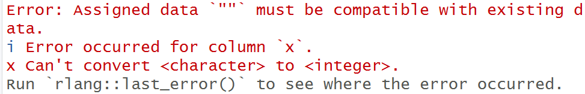

--- 
title: "Practical R: a concise manual"
author: "Lingyun Zhang"
date: "`r Sys.Date()`"
site: bookdown::bookdown_site
output: bookdown::gitbook
documentclass: book
link-citations: yes
links-as-notes: true
colorlinks: true
---

```{r setup, include=FALSE}
knitr::opts_chunk$set(echo = TRUE)
```

# Preface {-}

To be written.


# (PART\*) Part I: Data Importation {-}


# (PART\*) Part II: Data Manipulation {-}

# Tidyverse way {#ti}

In this chapter (Chapter \@ref(ti)) and the next one, we deal with **data frames**, and we cover

- how to create a data frame;
- how to select from the data frame the columns that we want;
- how to create a new column based on existed columns in the data frame;
- how to keep the rows that meet our set conditions;
- how to arrange the data frame based on some variables;
- how to change variables' names;
- how to re-arrange positions of variables in the data frame;
- how to have summary of the data frame;
- how to convert a *long* table to a *wide* table;
- how to convert a *wide* table to a *long* table;


The difference between Chapter \@ref(ti) and Chapter \@ref(dt) is that for the same task we use different tools (to be exact **functions**)---in this chapter we use functions that come from `tidyverse` package (to be exact, it's a collection of R packages, including `readr`, `tibble`, `dplyr`, `tidyr`, `ggplot2`, `purrr`, `stringr` and `forcats` as components), whereas in the next chapter we use functions that mainly belong to `data.table` package.

The first line of R codes in this chapter should be

`library(tidyverse)`

## `tibble`

What is a `tibble`? The short answer is: A tibble is a data frame---probably this is enough, but we may also want to know that---it's an enhanced data frame in a sense that it forces some rules (e.g. type rule) to be more strictly obeyed (the effects are: on one hand side, we lose some freedom associated with a data frame, on the other hand side, it prevents us from making some subtle mistakes while dealing with a data frame.) Tidyverse community encourages people to use tibbles. A tibble may not be working with some (old) packages, in that case, just use `as.data.frame()` to do converting. We can convert a data frame to a tibble by using `tibble::as_tibble()`. 

## Creating a tibble

We can use `data.frame()` to create a data frame; one important thing is that we should **almost always** set `stringsAsFactors = FALSE`. 

To create a tibble, we use `tibble::tibble()`

**Example 1:**
```{r warning=FALSE, message=FALSE}
a_df <- 
  data.frame(x = c(1L:3L, NA, NA),
             y = rnorm(5),
             z = c(NA, 'a', NA, 'b', 'c'),
             stringsAsFactors = FALSE)
(a_df)
```

**Example 2:**
```{r warning=FALSE, message=FALSE}
library(tidyverse)
a_tibble <- 
  tibble(x = c(1L:3L, NA, NA),
         y = rnorm(5),
         z = c(NA, 'a', NA, 'b', 'c'))
(a_tibble)
```


**Example 3:** tibble is more "strict"

We can run the following code if we want but it silently changes the type of variable `x` from integer to character.
```{r, warning=FALSE, message=FALSE, eval=FALSE}
a_df[is.na(a_df)] <- ""
```
If we run the following code we get an error message
```{r, warning=FALSE, message=FALSE, eval=FALSE}
a_tibble[is.na(a_tibble)] <- ""
```



## Selecting columns

We can use functions `select()` (plus `all_of()`) and `select_at()`.

**Example 1:**
```{r, warning=FALSE, message=FALSE}
b_df <- select(a_df, x, y)
(b_df)
(c(is_tibble(a_df), is_tibble(b_df), is.data.frame(b_df)))

c_df <- select_at(a_df, .var = c("z", "y"))
(c_df)

c1_df <- select(a_df, all_of(c("z", "y")))
(identical(c_df, c1_df))
```

**Example 2:** Selecting plus renaming
```{r, warning=FALSE, message=FALSE}
d_df <- select(a_df, new_x = x, new_y = y)
(d_df)
```

## Creating new column

We use function `mutate()`

**Example 1:**
```{r, warning=FALSE, message=FALSE}
e_df <- mutate(a_df, u = y^2, v = is.na(z))
(e_df)
```

## Keeping some rows

For keeping the rows that meet certain conditions, we use `filter()`.

**Example:**
```{r, warning=FALSE, message=FALSE}
f_df <- filter(a_df, abs(y) > 0.5 & !is.na(z))
(f_df)
```

If we want to choose rows using their position, the useful functions are: `slice(n1:n2)`, `slice_head(n = n1)`, `slice_tail(n = n2)`, `slice_sample(n = n1)` (or `slice_sample(prop = 0.x)`) 

**Example:**
```{r, warning=FALSE, message=FALSE}
fa_df <- slice_sample(a_df, prop = 0.4)
(fa_df)
```

Another two useful slice-functions: `slice_min()` and `slice_max()`.
**Example:**
```{r, warning=FALSE, message=FALSE}
fb_df <- slice_min(a_df, y, n = 2)
(fb_df)
fc_df <- slice_max(a_df, y, n = 2)
(fc_df)
```

## Arrange rows

Some rows of the data frame will be put at the top and other rows will be put at the bottom; for this purpose, we use `arrange()`.

**Example:**
```{r, warning=FALSE, message=FALSE}
g_df <- arrange(a_df, desc(z))
(g_df)

h_df <- arrange(a_df, desc(z), y)
(h_df)
```

## Changing variables' names

We use `rename()`.

**Example:**
```{r, warning=FALSE, message=FALSE}
i_df <- rename(a_df, new_z = z)
(i_df)
```

## Re-arranging variables' positions

For outputting purpose, we may want to re-arrange variables' positions, and we can use `select(df, all_of(a_ch_vec))` or `select_at(df, .var = a_ch_vec)` or `relocate()`. 

**Example:**
```{r, warning=FALSE, message=FALSE}
new_var_oder <- c("z", "y", "x")
j_df <- select(a_df, all_of(new_var_oder))
(j_df)
j_df_a <- select_at(a_df, .var = new_var_oder)
(j_df_a)
j_df_b <- relocate(a_df, c(z, y, x))
(j_df_b)
```

## Making summary/aggregation

We do some things like the following
```{r, eval=FALSE}
summ_df <- 
  a_df %>% 
  group_by(grp_var1, grp_var2) %>% 
  summarise(grp_total_of_v = sum(v), .groups = "drop")
```
and
```{r, eval=FALSE}
summ_df <- 
  a_df %>% 
  group_by(grp_var1, grp_var2) %>% 
  summarise(grp_count = n(), .groups = "drop")
```

**Example 1:** Making summary of one variable
```{r, warning=FALSE, message=FALSE}
fake_data <- 
  data.frame(type = rep(letters[1:3], each = 3),
             x = 1:9,
             y = rnorm(9),
             z = runif(9))

a_summ <- 
  fake_data %>% 
  group_by(type) %>% 
  summarise(grouped_mean_of_x = mean(x), .groups = "drop")
(a_summ)
```

**Example 2:** Making summary of many variables
```{r, warning=FALSE, message=FALSE}
b_summ <- 
  fake_data %>% 
  group_by(type) %>% 
  summarise(across(c(x, y, z), mean, .names = "grouped_mean_of_{.col}"), .groups = "drop")
(b_summ)
```

## On `group_by()`

Not only does `group_by()` work with `summarise()`, but it also works with other `dplyr` functions. Take notice the following points:

-  `group_by(grp_var) %>% summarise(, .groups = 'drop')`. The other arguments for `.groups` are `NULL` (the default), `'drop_last'` and `'keep'`. My habit is that always using `.groups = 'drop'`, in such a way the output is an un-grouped data frame.
- If `group_by()` has been used before `select()`, then the grouping variables must appear in `select()`. If we don't want these grouping variables, we do `ungroup()` before `select()`.
- `mutate()` under `group_by()`: see Example 1 below.
- `filter()` under `group_by`: see Example 2 below.
- `arrange()` under `group_by`: see Example 3 below.

**Example 1:**
```{r message=FALSE, warning=FALSE}
my_df <- 
  data.frame(g = rep(letters[1:3], each = 3),
             x = runif(9),
             y = LETTERS[1:9],
             stringsAsFactors = FALSE)
(my_df)

my_df_a <- 
  my_df %>%
  group_by(g) %>% 
  mutate(ID_in_grp = row_number()) %>% 
  ungroup()
(my_df_a)
```

**Example 2:**
```{r message=FALSE, warning=FALSE}
my_df_b <- 
  my_df_a %>% 
  group_by(g) %>% 
  filter(ID_in_grp == group_indices()) %>% 
  ungroup()
(my_df_b)
```

**Example 3:**
```{r message=FALSE, warning=FALSE}
my_df_c <- 
  my_df %>% 
  group_by(g) %>% 
  arrange(x, .by_group = TRUE) # order first by g and then x
(my_df_c)
```

## Convert long to wide table


# Data.table way {#dt}

The first line of R codes in this chapter should be

`library(data.table)`

What can be done with `dplyr` package (one component of `tidyverse` package; dplyr stands for "data frame apply r") can also be done using `data.table` package, and vice versa. Lots of people like `data.talbe` package for many reasons, in particular fast speed of data.table codes. To me, if I need to deal with data set of one million or more rows, then I will switch from using `dplyr` to `data.table` package. 

## `data.table`

What is a data.table? The answer is: It is an **enhanced version of data frame**. The meaning of 
"enhanced" is that it allows

`DT[i, j, by]`

that is, "take `DT`, subset/reorder rows using `i`, then calculate `j`, grouped by `by`" (see this and detailed explanations from https://cran.r-project.org/web/packages/data.table/vignettes/datatable-intro.html)

## Creating a data.table

We use `data.table()` to create a data.table. For converting from a data frame to a data.table, we use `SetDT` (especially for large data set) or `as.data.table`.
 
 **Example:**
```{r, warning=FALSE, message=FALSE}
library(data.table)
a_dt <- 
  data.table(ID = letters[1:5],
             x = 1:5,
             y = month.name[1:5])
(a_dt)
```

## Selecting columns

The syntax is:

`DT[, .(<sel_var1 => var1, <sel_var2 => var2)]`
where `<...>` means optional;

or

`DT[, c("var1", "var2")]`

or
```{r, eval=FALSE}
sel_cols <- c("var1", "var2")
DT[, sel_cols, with = FALSE]
```


**Example:**
```{r, warning=FALSE, message=FALSE}
b_dt <- a_dt[, .(new_y = y, new_x = x)]
(b_dt)

vars_to_choose <- c("ID", "y")
c_dt <- a_dt[, vars_to_choose, with = FALSE]
(c_dt)
```

## Creating new column

The syntax is

```{r, eval=FALSE}
new_DT  <- copy(DT)
new_DT[, `:=`(new_var = func(existed_vars))]
```

If we care about memory and are aware of all possible *side effects* on the original `DT`, we can do
```{r, eval=FALSE}
DT[, `:=`(new_var = func(existed_vars))]
```
About "side effects" of `:=`, see https://cran.r-project.org/web/packages/data.table/vignettes/datatable-reference-semantics.html


**Example:**
```{r, warning=FALSE, message=FALSE}
(the_name <- names(a_dt))
new_dt <- copy(a_dt)
new_dt[, `:=`(u = x^2)]
(new_dt)

a_dt[, `:=`(u = x^2)]
(a_dt)
(the_name) # it's also updated!
```

## Keeping some rows

The syntax is
```{r, eval=FALSE}
new_DT <- DT[var1 == sth & var2 > sth | vars != sth]
```

**Example:**
```{r, warning=FALSE, message=FALSE}
dt_new <- a_dt[x%%2 == 0 | u == 9]
(dt_new)
```


## Arrange rows

The syntax is
```{r, eval=FALSE}
DT[order(var1, -var2)]
```

**Example:**
```{r, warning=FALSE, message=FALSE}
d_dt <- a_dt[order(-ID)]
(d_dt)
```

## Changing variables' names

The syntax is
```{r, eval=FALSE}
setnames(DT, "old_name", "new_name")
```

**Example:**
```{r, warning=FALSE, message=FALSE}
setnames(a_dt, c("x", "y"), c("new_x", "new_y"))
(a_dt)
```

## Re-arranging variables' positions

The syntax is
```{r, eval=FALSE}
setcolorder(DT, neworder = new_order)
```

**Example:**
```{r, warning=FALSE, message=FALSE}
setcolorder(a_dt, neworder = c("ID", "u", "new_y", "new_x"))
(a_dt)
```

## Making summary/aggregation

The syntax: 
```{r, eval=FALSE}
summ_dt <- DT[, .(grp_total_of_v = sum(v)), by = .(grp_var1, grp_var2)]  
```
and for counting
```{r, eval=FALSE}
summ_dt <- DT[, .(grp_count = .N), by = .(grp_var1, grp_var2)] 
```
and for summarizing many variables
```{r, eval=FALSE}
summ_dt <- DT[, lapply(.DT, mean), by = .(grp_var1, grp_var2), .SDcols = c("var1", "var2")]
```

**Example 1:** Making summary of one variable
```{r, warning=FALSE, message=FALSE}
fake_dt <- 
  data.table(type = rep(letters[1:3], each = 3),
             x = 1:9,
             y = rnorm(9),
             z = runif(9))

a_summ_dt <- fake_dt[, .(grouped_mean_of_x = mean(x)), by = type]
(a_summ_dt)

b_summ_dt <- fake_dt[, .(grouped_count = .N), by = type]
(b_summ_dt)
```

**Example 2:** Making summary of many variables
```{r, warning=FALSE, message=FALSE}
c_summ_dt <- fake_dt[, lapply(.SD, mean), by = type,
                     .SDcols = c('x', 'z')]
(c_summ_dt)
```


# (PART\*) Part III: Data Exportation {-}


# (PART\*) Part IV: Data Visualization {-}

# Base R

# `ggplot` + `gridExta` + `patchwork`


# (PART\*) Part V: Repeating Work {-}

# Writing functions

# apply family functions

For *iterations* (repeating work), base R provides apply family functions. In my opinion, the mostly useful ones are `apply()` (taking a matrix as input), `lapply()` (taking a list as input) and `sapply()` (taking a list as input, but may be handier in some situations). 

**Example 1:** Using `apply()`
```{r}
a_matrix <- matrix(1:9, ncol = 3, byrow = TRUE)
row_sums <- apply(a_matrix, 1, sum)
col_sums <- apply(a_matrix, 2, sum)
(list("row_sums" = row_sums, "col_sums" = col_sums))
```

**Example 2:** Using `lapply()`: bootstrap confidence interval
```{r}
set.seed(31415)
a_sample <- rnorm(10)
my_sampling <- function()
{b_sample <- sample(a_sample, size = 10, replace = TRUE)
 mean(b_sample)
}
bootstrap_mean <- 
  unlist(lapply(1:1000, 
                FUN = function(i) my_sampling()))
# or
# bootstrap_mean <-
#   sapply(1:1000,
#          FUN = function(i) my_sampling())
lower_and_upper_limits <- 
  quantile(bootstrap_mean, probs = c(0.025, 0.975))
lower_and_upper_limits
```


# `purrr` package

# multiple core apply

# `for` loops


# (PART\*) Part VI: Other Packages {-}

# `stringr` package

# `lubridate` package

# `gt` package

# `leaflet` package

# `shiny` package

# `knitr` package


<!-- # (PART\*) Part VI: Snapshots of Other Packages {-} -->


